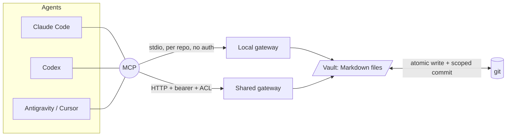
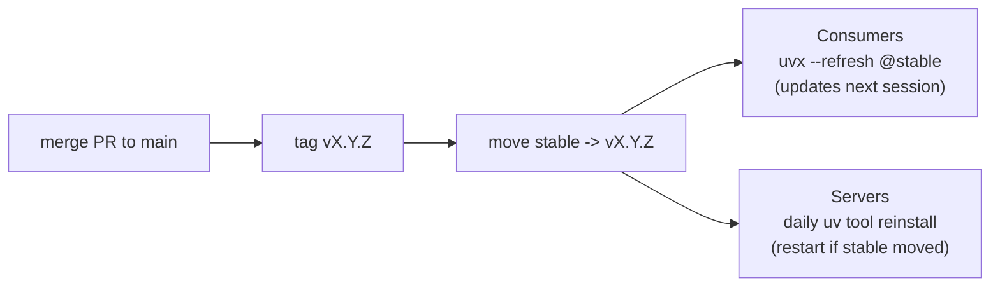

# obsidian-gateway

A filesystem- and git-native **MCP gateway** for Obsidian vaults. AI agents (Claude Code,
Codex, Cursor, Antigravity) read, search, and **edit** a vault through git-aware,
Obsidian-aware tools - with **no Obsidian GUI running**, and git as the single source of truth.

It exists because the Obsidian *Local REST API* plugin serves only the one vault open in a
running desktop instance, writes without a lock (silent lost updates), requires a token in
every client, and treats git as secondary. This gateway operates on the Markdown files
directly, with git as the system of record.

## Architecture



Both modes run the **same** tool implementation over the **same** path guards; they differ in
transport, authentication/ACL, vault loading, and error masking.

## Two ways to run

| | **Local mode** (per repo) | **Shared server** (team) |
|---|---|---|
| Use when | a repo wants its own vault for its agents | many people/vaults behind one always-on endpoint |
| Transport | stdio subprocess (launched by `.mcp.json`) | HTTP (put behind Tailscale/HTTPS) |
| Secrets / tokens | **none** - nothing to generate | per-user bearer tokens (admin-generated) |
| Trust boundary | local filesystem access you already have | tailnet + HTTPS + per-vault ACL |
| Obsidian needed | no | no |

Most repos want **Local mode**. The shared server is only for a central, always-on team gateway.

## Distribution - the `stable` branch ("update once")

The gateway ships from one moving branch, so a release reaches every consumer and server
without re-pinning anything by hand.



- **Consumers** pin `@stable` with `uvx --refresh` -> the ref is re-fetched on every launch, so
  a new release auto-propagates the next time an agent starts. No per-repo re-pin.
- **Servers** (long-running) run a pinned `uv tool install @stable` plus a daily job that
  reinstalls + restarts only when `stable` actually moves.
- Every release is **also** an immutable `vX.Y.Z` tag - pin a tag instead of `stable` when you
  need a frozen, auditable version.

> A moving *tag* does not work (uvx caches the resolved commit); a *branch* + `--refresh` does.

## Quickstart - local mode (zero secrets)

Add this to the repo's `.mcp.json` at the repo root:

```jsonc
{
  "mcpServers": {
    "wiki": {
      "command": "uvx",
      "args": ["--refresh", "--from", "git+https://github.com/fszalaj/obsidian-gateway@stable",
               "obsidian-gateway", "--local"]
    }
  }
}
```

- `--local` auto-detects the vault in the cwd, in order: the cwd itself if it has `.obsidian/`,
  then `./wiki`, then a single `*-obsidian-vault/`, then a single child dir with `.obsidian/`
  (ambiguous matches error). Pass `--vault ./<dir>` to be explicit.
- `--refresh` re-fetches `@stable` each launch, so releases auto-apply (adds ~1-2s to start).
- Commits are scoped to the vault's git subdir and attributed to your own
  `git config user.name/email`. No token: the trust boundary is local filesystem access.

Open the repo in your agent, approve the `wiki` server once, done.

## Tools

| Tool | |
|---|---|
| `list_vaults` | vaults reachable here |
| `list_notes` | Markdown paths in a vault |
| `read_note` | raw note content |
| `search` | ripgrep literal/regex full-text |
| `backlinks` | notes that `[[wikilink]]` to a note |
| `list_tags` | inline `#tags` with counts |
| `query_notes` | find notes by frontmatter `type` / `tag` (headless Dataview-lite) |
| `write_note` | atomic write (+ optional commit) |
| `patch_note` | insert after a heading or at top/bottom, no full rewrite (+ commit) |
| `patch_frontmatter` | update YAML frontmatter keys, body intact (+ commit) |
| `delete_note` | delete a note (+ optional commit) |
| `rename_note` | rename/move + rewrite inbound flat `[[wikilinks]]` when the name changes (+ optional commit) |
| `git_status` / `git_commit` | pending changes / commit (subdir-scoped, attributed) |

Edits are atomic (temp file + `rename`). Every path goes through `safe_note_path`, which blocks
traversal, symlink escape, hidden/dotfiles, non-`.md` targets, and `.git`/`.obsidian` - a caller
can never read or write outside the vault's notes.

## Shared server mode

Run this only for a central, always-on gateway reachable over the network.

**1. Map vaults** - `cp vaults.example.yaml vaults.yaml`, then set `name -> path / repo_root /
subdir`. `repo_root` + `subdir` pathspec-scope commits to a vault that lives inside a larger repo.

**2. Mint a token per user** (the admin does this):

```bash
cp tokens.example.yaml tokens.yaml
openssl rand -hex 32          # once PER user -> the key
chmod 0600 tokens.yaml        # refused at load if group/world-readable
```

```yaml
tokens:
  "8f3c…hex…":
    sub: alice                # identity recorded on that user's commits
    vaults: [teamwiki]        # the ONLY vaults this token may see/touch
    write: true               # false = read-only
```

A token sees only the vaults in its `vaults` list; anything else returns an opaque
`vault_forbidden`. `vaults.yaml` + `tokens.yaml` are gitignored.

**3. Run** - `uv run obsidian-gateway` (127.0.0.1:8765, path `/mcp/`). For a team box, run it as
a service behind Tailscale Serve - see `deploy/` and *Operate* below.

**4. Connect** - the admin shares the token over a password manager (not chat):

```bash
claude mcp add --transport http --scope project teamwiki \
  https://YOUR-HOST.<tailnet>.ts.net/mcp/ --header "Authorization: Bearer $GW_TOKEN"
```

## Security model

- **No secrets in the repo.** `vaults.yaml` / `tokens.yaml` are gitignored; only
  `*.example.yaml` ship. `tokens.yaml` is refused at load if group/world-readable.
- **Local mode has no credential surface** - a local stdio subprocess; the trust boundary is
  filesystem access the user already has.
- **Server mode is defense in depth, not a public endpoint** - tailnet ACL + HTTPS + per-user
  `StaticTokenVerifier` bearer token + per-vault ACL. The bearer layer is a shared secret for
  use **behind a trusted tailnet**; do not expose the server publicly.
- **Path guards on all note I/O** via `safe_note_path` (traversal, symlink, hidden/dotfiles
  incl. `.env`, non-`.md`, `.git`/`.obsidian`). Search/backlinks/tags are bounded to `*.md`.
- **Server-mode error masking** - the HTTP server runs `mask_error_details=True`: only the
  gateway's own expected failures surface as `ToolError`; unexpected OS/git errors are hidden.
  Local mode keeps details visible.
- **Commits are attributed** to the requesting user (server) or the local git identity (local),
  and pathspec-scoped to the vault subdir.

## Set it up with an AI

Paste this into an agent at a repo's root to wire in local mode:

```
Add the obsidian-gateway to this repo so agents can read/edit our vault over MCP with zero
tokens:
1. Create or merge `.mcp.json` at the repo root with an mcpServers."wiki" entry that runs:
   uvx --refresh --from git+https://github.com/fszalaj/obsidian-gateway@stable obsidian-gateway --local
   (`--local` auto-detects the vault: ./wiki, a *-obsidian-vault dir, or a dir with .obsidian/.
   If detection is ambiguous, use `--vault ./<vault dir>` instead of `--local`.)
2. Verify: `uvx --refresh --from git+https://github.com/fszalaj/obsidian-gateway@stable \
   obsidian-gateway --help` resolves; then in the agent, call list_vaults and read one note.
Branch + PR, no direct push, no AI attribution.
```

For the shared server, ask your gateway admin for a token, then run the `claude mcp add …` from
*Connect* above.

## Operate (servers)

A server runs the `@stable` release as a `uv tool`, with a daily job that reinstalls and
restarts only when `stable` moved. Reference units are in `deploy/`:

```bash
uv tool install --from git+https://github.com/fszalaj/obsidian-gateway@stable obsidian-gateway
# the binary lives in the uv cache, so point config at the live files via env:
#   OBSIDIAN_GATEWAY_VAULTS=<dir>/vaults.yaml   OBSIDIAN_GATEWAY_TOKENS=<dir>/tokens.yaml
```

- `deploy/obsidian-gateway.service` - the service (systemd `--user`).
- `deploy/obsidian-gateway-update.{service,timer}` + `deploy/auto-update.sh` - the daily auto-update.

Update now instead of waiting for the timer: `uv tool install --reinstall --from
git+https://github.com/fszalaj/obsidian-gateway@stable obsidian-gateway`, then restart the
service. Health: `curl -s -o /dev/null -w '%{http_code}' http://127.0.0.1:8765/mcp/` -> `401`.

## Release (maintainers)

1. PR -> merge to `main` (CI: `uv lock --check`, pytest matrix).
2. Bump `pyproject.toml` version + `CHANGELOG.md`.
3. Tag `vX.Y.Z` and push the tag (the release workflow builds it).
4. Move `stable`: `git branch -f stable vX.Y.Z && git push --force-with-lease origin stable`.

Consumers pick it up next session; servers within a day (or restart now).

## Develop

```bash
uv venv && uv pip install -e ".[dev]"
uv run pytest                              # ACL + path guards + edit/frontmatter + detect + masking
```
